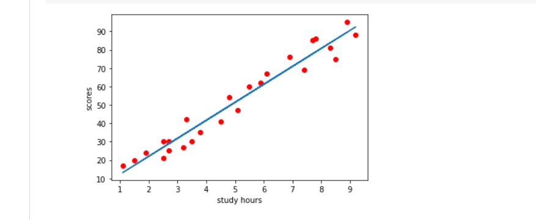
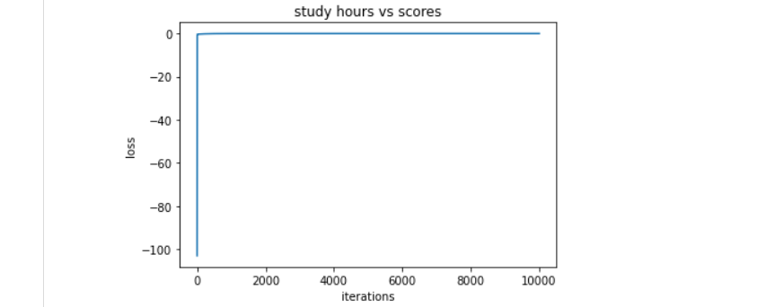

# Implementation-of-Linear-Regression-Using-Gradient-Descent

## AIM:
To write a program to implement the linear regression using gradient descent.

## Equipments Required:
1. Hardware – PCs
2. Anaconda – Python 3.7 Installation / Moodle-Code Runner

## Algorithm
### 1.
go to moodle,click the link and fork the experiment to your git hub account and again click fork 
### 2.
create new folder in documents and name as my project 
### 3.
open visual studio code and clone the repositories to it  
### 4. 
run necessary code in terminal and generate output and take screen shot of it make pdf and submit url link in moodle 

## Program:
```
import numpy as np
import pandas as pd
import matplotlib.pyplot as plt
data = pd.read_csv("student_scores.csv")
data.head()
data.isnull().sum()
x = data.Hours
x.head()
y = data.Scores
y.head()
n = len(x)
m = 0
c = 0
L = 0.001
loss = []
for i in range(10000):
    ypred = m*x+c
    MSE = (1/n)*sum((ypred-y)*2)
    dm = (2/n)*sum(x(ypred-y))
    dc = (2/n)*sum(ypred-y)
    c = c-L*dc
    m = m-L*dm
    loss.append(MSE)
    #print(m)
print(m,c)
y_pred = m*x+c
plt.scatter(x,y,color = "cyan")
plt.plot(x,y_pred)
plt.xlabel("Study hours")
plt.ylabel("Scores")
plt.title("Study hours .vs. Scores")
plt.plot(loss)
plt.xlabel("Iterations")
plt.ylabel("loss")
```

## Output:
### study hours and scores

### study hours vs scores



## Result:
Thus the program to implement the linear regression using gradient descent is written and verified using python programming.
